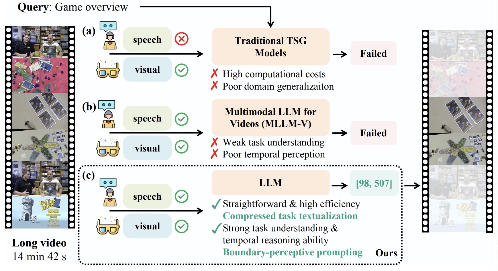

# Grounding-Prompter: An LLM Agent Framework for Temporal Sentence Grounding(TSG)

Official Implementation of "**Grounding-Prompter: Prompting LLM with Multimodal Information for Temporal Sentence Grounding in Long Videos**".




Localizing a moment in a long-form video is quite necessary in real life, like localizing a video clip in a long news report that you are interested in. However, such is challenging. Existing traditional TSG works fail to handle long video sequences for high computational costs and poor generalization. Besides, speech information is also important especially in long-form videos but these TSG works ignore it. Video Multimodal LLMs are able to understand both text and video contexts but they are proved to struggle in TSG task because they are weak in understanding TSG task and perceiving temporal information in videos. To address the TSG in long videos, we are the first to reformulate it in textual settings and propose a Grounding-Prompter method to solve it by LLM since LLMs are expert in language modality. We textualize visual and speech information to compress videos in text domain and design a Boundary-Perceptive Prompting strategy to better align LLM to TSG task, resulting state-of-the-art unbiased performance in long-form videos(~15 min).


## Quick Start
The directory structure is as follows:
```
-- dataset
    -- vidchapter_mini.json
-- outputs
-- prompts
    -- prompts.json
    -- answers.json
-- src
    -- gpt.py
    -- eval.py
```

We have already processed the vidchapters dataset and get the vidchapters_mini well prepared. The query, visual captions and asr are ready in `vidchapter_mini.json`.

To use our framework, you just need to fill in your openai key in `gpt.py` and prepare the prompts and ground truth answers in `prompts.json` and `answers.json`. like the format:

```python
prompts = ['case 1 prompt','case 2 prompt',...]
answers = [[0,33],[123,199],...]
```
Then run `gpt.py` and `eval.py`.


## Acknowledgment
Thanks to [VidChapters](https://antoyang.github.io/vidchapters.html) for its great work, which might be a nice benchmark for TSG in long videos in the future, especially requiring methods to both use speeches and visual content.


## Cite
If you feel this repo is helpful to your research, please cite & star : )
```
@misc{chen2023groundingprompter,
      title={Grounding-Prompter: Prompting LLM with Multimodal Information for Temporal Sentence Grounding in Long Videos}, 
      author={Houlun Chen and Xin Wang and Hong Chen and Zihan Song and Jia Jia and Wenwu Zhu},
      year={2023},
      eprint={2312.17117},
      archivePrefix={arXiv},
      primaryClass={cs.CV}
}
```